<!-- Generated by GitHub Profile Agent Console. Edit profile.config.json, then run npm run generate. -->

  <picture>
    <source media="(max-width: 760px) and (prefers-color-scheme: dark)" srcset="./assets/hero/agent-console-c80614f9-mobile-dark.svg">
    <source media="(max-width: 760px)" srcset="./assets/hero/agent-console-c80614f9-mobile-light.svg">
    <source media="(prefers-color-scheme: dark)" srcset="./assets/hero/agent-console-c80614f9-dark.svg">
    <source media="(prefers-color-scheme: light)" srcset="./assets/hero/agent-console-c80614f9-light.svg">
    
  </picture>

  
  

## About Me

I am a student who is pursuing a career as a web designer.

My work combines technical exploration with a builder mindset: understand the problem, test the system, and share what actually works.

## Current Focus

| Area | What I am exploring |
| --- | --- |
| **AI Agents** | Autonomous workflows, tool use, evaluation, and reliable agent behavior. |
| **Applied AI** | Turning model capabilities into useful and testable software systems. |
| **Developer Tools** | Better workflows for building, testing, and operating modern software. |

## Featured Work

| Project | Focus | Why it matters |
| --- | --- | --- |
| [**MusicPlay**](https://github.com/Muad-syntax/MusicPlay.git) | Music Adjuster | Website-based music player application [Live](https://muad-syntax.github.io/MusicPlay/) |
| [**javascript**](https://github.com/Muad-syntax/javascript.git) | my learning repository | Learning during school about basic JavaScript [Live](https://muad-syntax.github.io/javascript/HitungBMI/inputTestBMI.html) |
| [**BoxShadowGenerator**](https://github.com/Muad-syntax/BoxShadowGenerator.git) | Box Shadow Generator for using CSS | makes it easy to change the appearance of the box shadow for CSS use [Live](https://muad-syntax.github.io/BoxShadowGenerator/) |
| [**game-javascript**](https://github.com/Muad-syntax/game-javascript.git) | Game snake javascript | create a snake game using javascript [Live](https://muad-syntax.github.io/game-javascript/ular/ular.html) |

## Research Direction

I am interested in systems that can observe state, use tools, evaluate outcomes, and take bounded actions with clear evidence and human oversight.

## Tech Stack

`Javascript` · `Python` · `PHP` · `Java`

## Recent Activity

<!-- AUTO:ACTIVITY:START -->
- Jul 17, 2026: pushed 1 commit to [Muad-syntax/Muad-syntax](https://github.com/Muad-syntax/Muad-syntax).
- Jul 17, 2026: created a branch in [Muad-syntax/Muad-syntax](https://github.com/Muad-syntax/Muad-syntax).
- Jul 16, 2026: pushed 1 commit to [Muad-syntax/MusicPlay](https://github.com/Muad-syntax/MusicPlay).
- Jul 15, 2026: created a branch in [Muad-syntax/MusicPlay](https://github.com/Muad-syntax/MusicPlay).
- Jun 21, 2026: created a branch in [Muad-syntax/BoxShadowGenerator](https://github.com/Muad-syntax/BoxShadowGenerator).
- Jun 18, 2026: pushed 1 commit to [Muad-syntax/javascript](https://github.com/Muad-syntax/javascript).
<!-- AUTO:ACTIVITY:END -->

---

  Building thoughtful systems and sharing what works.

